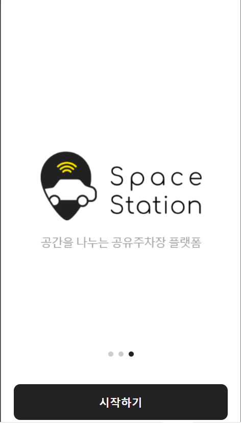
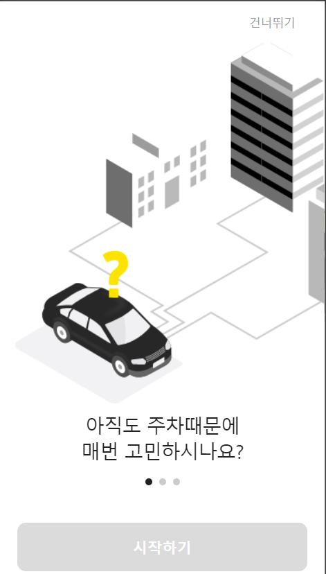
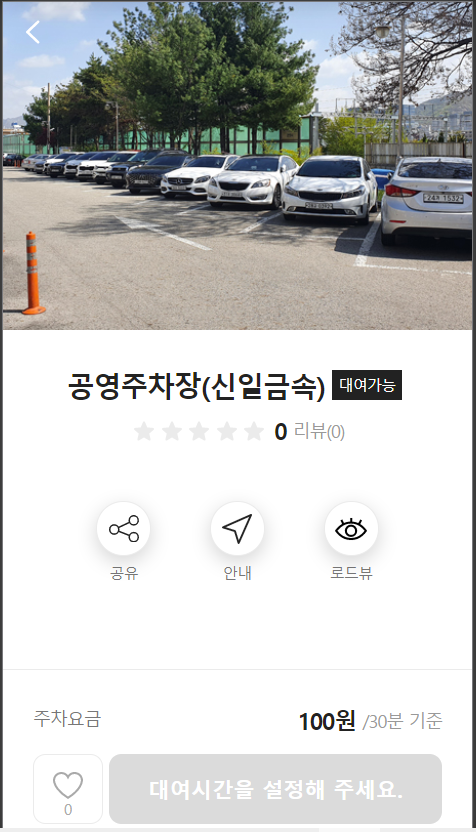
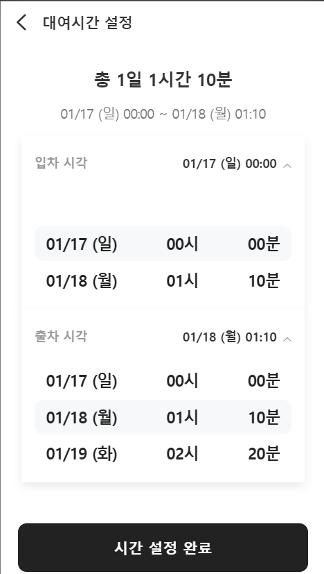
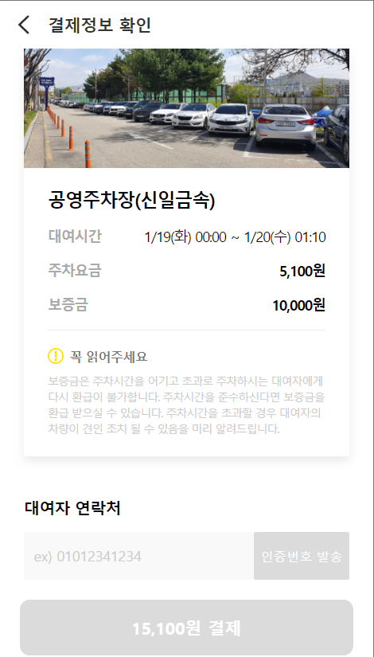
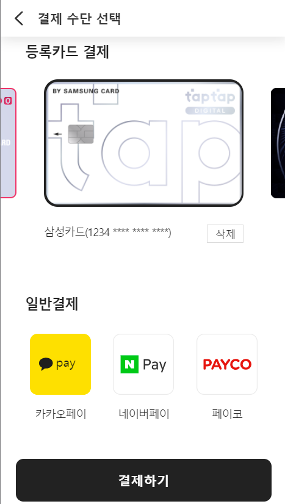
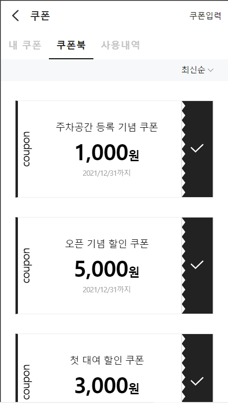
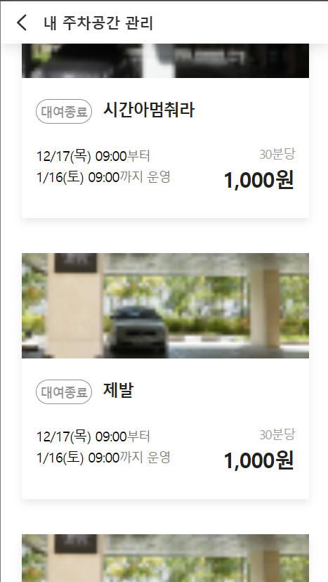
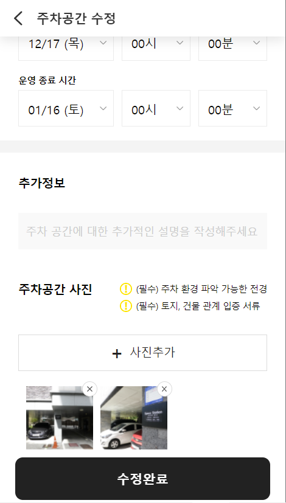
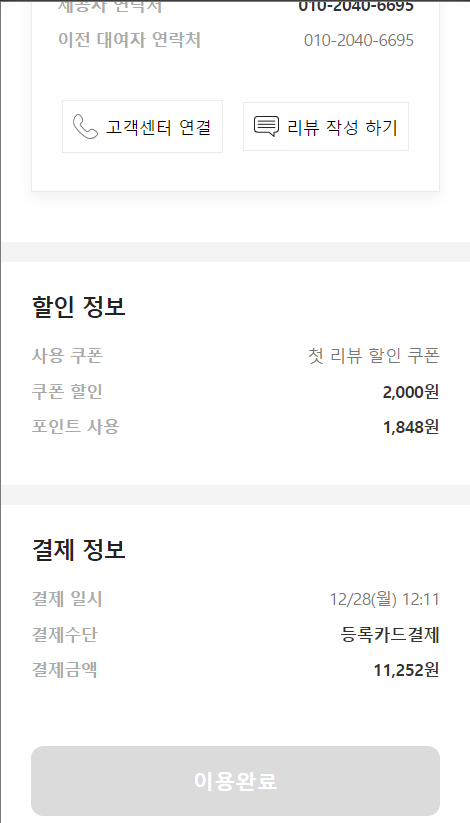

# Everyones-parking-lot

## Introduce
모두의 주차장 주차공유 플랫폼으로 외주 개발한 프로젝트 입니다. 주차공간 등록, 결제, 휴대폰인증 로그인 등 웹에서 사용하는 대부분의 기능을 사용해 웹앱의 전체적인 흐름을 이해할 수 있었습니다.

## Tech
- React
- React-Redux
- Redux-Saga
- React-Router
- SCSS
- axios

## 시작 페이지
- 최초 앱 접속시 간단한 앱 소개페이지를 보여줍니다.
- localStorage를 사용해 앱을 처음 실행할 때만 앱 소개페이지를 보여줍니다.

   
   

## 메인 페이지
- 주차장 상세정보를 보여주며 SNS공유, 지도로 안내, 로드뷰를 볼 수 있습니다

   

## 주차장 대여 기능
- 주차장 시간을 설정하고 주차가능한 시간에 대여할 수 있는 기능이 있습니다.
- 로그인 되어있는 경우 대여가능하며 연락처정보를 통해 인증 후 결제페이지로 넘어갑니다.
- 카드를 등록하고 결제시 선택할 수 있으며 쿠폰이 있다면 할인결제도 가능합니다.

   
   
   
   

## 내 주차공간 관리
- 대여한 주차공간 목록과 상태를 확인할 수 있습니다.
- 아직 종료되지 않은 주차공간의 경우 대여정보를 수정할 수 있습니다.

   
   
   

